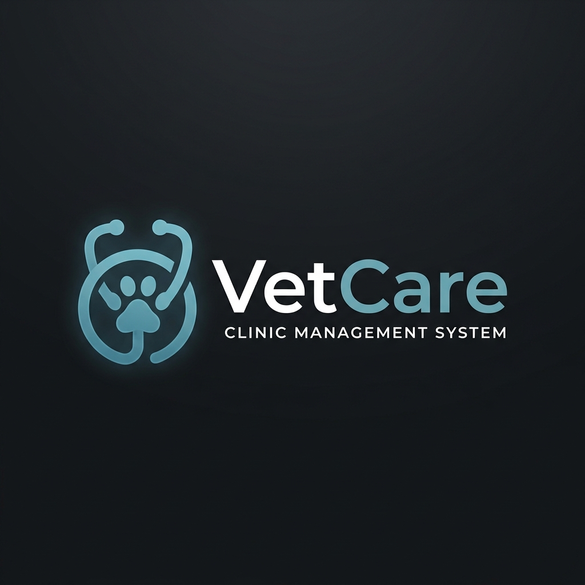

<p align="center">
  
</p>

<h1 align="center">VetCare Mobile</h1>

<p align="center">
  <strong>A Premium Full-Stack Veterinary Clinic Management Solution</strong>
</p>

<p align="center">
  
  
  
  
  
</p>

---

## 🌟 Overview

**VetCare Mobile** is a sophisticated, full-stack mobile application designed to streamline veterinary clinic operations. Built with a modern tech stack (React Native, Node.js, and MongoDB), it provides a seamless experience for managing patients, appointments, billing, inventory, and reporting—all from the palm of your hand.

This project is an independent mobile companion to the VetCare ecosystem, offering high-performance API integrations and a premium UI/UX.

---

## 🚀 Core Modules & Features

### 🔐 Secure Access
- **JWT Authentication**: Role-based access control for Admins, Doctors, and Staff.
- **Secure Storage**: Encrypted user credentials and session management.

### 🐾 Patient & Medical Management
- **Electronic Health Records (EHR)**: Full lifecycle management of pet patients.
- **Medical Records & Conditions**: Track history, allergies, and ongoing treatments.
- **Treatment Scheduling**: Automated tracking of follow-up visits and medications.

### 📅 Appointment System
- **Real-time Scheduling**: Manage clinic flow with ease.
- **Status Tracking**: Monitor appointments from 'Pending' to 'Completed'.

### 🧪 Lab & Diagnostics
- **Lab Request Management**: Create and track lab requests.
- **Result Integration**: Update statuses as reports are received.

### 📦 Inventory & Pharmacy
- **Stock Management**: Real-time tracking of products and medical supplies.
- **Supplier Management**: Maintain relationships and track purchases.
- **Stock Alerts**: Stay ahead of inventory needs.

### 💳 Financials & Billing
- **Dynamic Invoicing**: Generate professional invoices with itemized billing.
- **Payment Tracking**: Record partial and full payments.
- **Expense Management**: Track clinic overheads and operating costs.

### 📊 Advanced Reporting
- **Business Intelligence**: 7+ report types including Financial, Stock, Profit/Loss, and Trending treatments.

---

## 🛠️ Technology Stack

| Component | Technology |
|---|---|
| **Mobile Frontend** | React Native (Expo SDK 51), React Navigation v6 |
| **Styling** | Native Wind / Custom Premium Theme |
| **API Client** | Axios with interceptors for Auth |
| **Backend** | Node.js, Express.js |
| **Database** | MongoDB Atlas with Mongoose ORM |
| **Security** | JWT, BcryptJS, CORS |
| **Infrastructure** | Render (API), MongoDB Atlas (DB), Expo EAS (Build) |

---

## 📂 Project Structure

```text
VETCARE_mobile/
├── backend/          # Node.js + Express.js REST API
│   ├── src/models/   # Mongoose Schemas
│   ├── src/routes/   # API Endpoints
│   └── ...
└── mobile/           # React Native (Expo) Mobile App
    ├── src/screens/  # UI Modules
    ├── src/api/      # Backend Integration
    └── ...
```

---

## ⚙️ Installation & Setup

### 1. Backend Configuration
1. Navigate to the backend directory:
   ```powershell
   cd backend
   ```
2. Install dependencies:
   ```powershell
   npm install
   ```
3. Setup environment variables (`.env`):
   ```env
   PORT=5000
   MONGODB_URI=your_mongodb_connection_string
   JWT_SECRET=your_secure_secret
   ```
4. Start the server:
   ```powershell
   npm run dev
   ```
5. Seed initial data (Admin/Doctor/Staff):
   ```powershell
   npm run seed:admin
   ```

### 2. Mobile Configuration
1. Navigate to the mobile directory:
   ```powershell
   cd mobile
   ```
2. Install dependencies:
   ```powershell
   npm install
   ```
3. Configure API base URL in `src/api/client.js`:
   ```javascript
   const API_BASE_URL = 'http://YOUR_LOCAL_IP:5000/api';
   ```
4. Launch the app:
   ```powershell
   npm start
   ```

---

## 🌐 Live Deployment

### Backend (Render/Railway)
- The API is designed for stateless deployment.
- Ensure `MONGODB_URI` points to a MongoDB Atlas cluster.
- Set `NODE_ENV=production`.

### Mobile (Expo EAS)
Build for Android/iOS using Expo Application Services:
```powershell
eas build --platform android
```

---

## 📝 API Summary (Key Endpoints)

- `POST /api/auth/login` - Secure authentication.
- `GET /api/patients` - List pet records with search.
- `GET /api/appointments` - Calendar and list views.
- `GET /api/dashboard` - Clinic statistics overview.
- `GET /api/reports/*` - Advanced data analytics.

---

<p align="center">
  <em>Developed with ❤️ for the Veterinary Community.</em>
</p>
